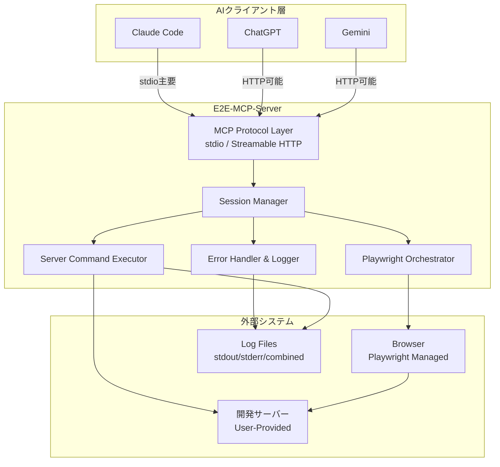
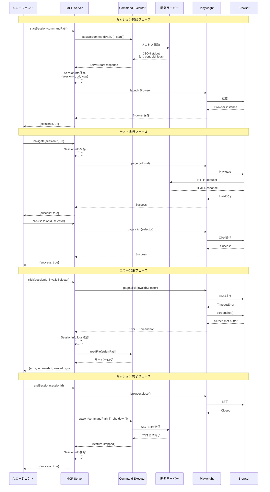
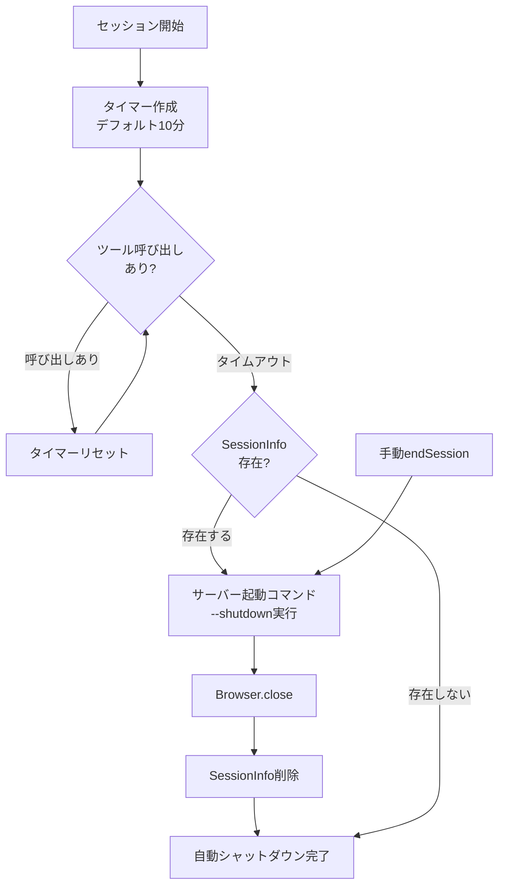
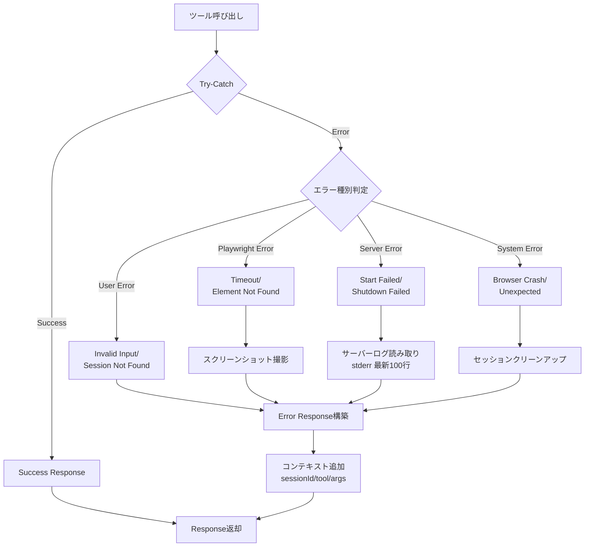

# Technical Design Document

## Overview

E2E-MCP-Serverは、AIエージェント（Claude Code、ChatGPT、Gemini等）がE2Eテストを実行する際のサーバー管理の煩雑さを解消するModel Context Protocolサーバーです。従来のPlaywright MCPでは開発サーバーの状態管理をAIエージェント自身が行う必要がありましたが、本サーバーはサーバープロセスのライフサイクル管理をMCP層に移譲し、AIエージェントがテストロジックに専念できる環境を提供します。

本サーバーは、ユーザーが提供するサーバー起動コマンド（動的ポート割り当て、ログ管理機能を持つ）を実行し、そのレスポンスから取得したURL・ログパスをセッション情報として管理します。Playwright操作のすべてをMCPツールとして公開し、エラー発生時には自動的にサーバーログとスクリーンショットを収集してAIエージェントに提供します。

**Users**: AIエージェント開発者が、E2Eテスト自動化のために利用します。開発サーバーの起動・停止を意識せず、テストシナリオの記述とアサーションの実装に集中できます。

### Goals
- AIエージェントからのMCPツール呼び出しでE2Eセッション（開発サーバー起動からテスト実行、サーバー停止まで）を完全自動化
- Playwrightの主要機能をMCPツールとして提供し、既存Playwright MCPと同等の操作性を実現
- エラー発生時のデバッグ情報（サーバーログ、スクリーンショット、構造化エラー詳細）を自動収集し、AIエージェントの根本原因分析を支援
- 複数のAIクライアント（Claude Code、ChatGPT、Gemini）から標準的なMCPプロトコルでアクセス可能なサーバーを提供

### Non-Goals
- サーバー起動コマンド自体の実装（ユーザー提供の責務）
- E2Eテストのアサーションロジック生成（AIエージェントの責務）
- 複数の開発サーバーを並列管理する機能（1セッション1サーバーのシンプルな設計）
- Playwright以外のE2Eテストフレームワーク（Cypress、Selenium等）のサポート

## Architecture

### High-Level Architecture



**Architecture Integration**:
- **Existing patterns preserved**: なし（新規プロジェクト）
- **New components rationale**:
  - MCP Protocol Layer: MCP標準準拠のトランスポート層（stdio主要、Streamable HTTPオプション）
  - Session Manager: セッション情報（URL、PID、ログパス）の保存と自動シャットダウンタイマー管理
  - Server Command Executor: ユーザー提供のサーバー起動コマンドを実行し、JSONレスポンスをパース
  - Playwright Orchestrator: Playwright操作をMCPツールとして公開
  - Error Handler & Logger: エラー発生時のログ読み取りとスクリーンショット自動撮影
- **Technology alignment**: TypeScript、MCP SDK、Playwrightという標準的なNode.jsエコシステムを採用
- **Steering compliance**: ステアリングファイル未作成（新規プロジェクト）のため、本設計が今後のステアリング基準となる

### Technology Stack and Design Decisions

#### Backend Layer
- **Language & Runtime**: TypeScript 5.x + Node.js 20.x LTS
  - **Rationale**: MCP SDKとPlaywrightの公式サポート、型安全性による保守性向上
  - **Alternatives**:
    - Python: MCP SDKサポートあり、しかしPlaywright TypeScript APIの型定義が充実
    - Go: パフォーマンス優位だが、MCP公式SDKが未成熟

#### MCP Protocol Layer
- **MCP SDK**: @modelcontextprotocol/sdk 1.20.2以降
  - **Rationale**: 公式SDK、stdio/Streamable HTTP両対応、セキュリティアップデート（DNS rebinding protection）
  - **Alternatives**: 独自実装（保守コスト高、仕様準拠の保証なし）

- **Transport**: stdio (主要) / Streamable HTTP (オプション)
  - **Primary: stdio** (MCP Specification 1.0 - Standard Input/Output)
    - **Rationale**: ローカル開発の主要ユースケース、Claude Code等が`npx`コマンドで直接起動可能、サーバープロセス管理不要
    - **Use Case**: `.mcp.json`に`command`と`args`を記述して起動（例: `"command": "npx", "args": ["e2e-mcp-server"]`）
  - **Optional: Streamable HTTP** (MCP Specification 2025-03-26)
    - **Rationale**: Cloud Run等のコンテナ環境デプロイ、リモートMCPサーバーとしての利用
    - **Use Case**: Cloud Runにデプロイし、`.mcp.json`に`"type": "http"`でURL指定して接続
  - **Alternatives**:
    - HTTP+SSE: 2025年3月に非推奨化、将来的にサポート終了

#### E2E Testing Layer
- **Browser Automation**: Playwright 1.40以降
  - **Rationale**: TypeScript型定義充実、複数ブラウザ対応、スクリーンショット・トレース機能
  - **Alternatives**:
    - Puppeteer: Chromium専用、型定義やや弱い
    - Selenium: 古い設計、非同期処理が煩雑

#### Infrastructure Layer
- **Deployment**: Google Cloud Run
  - **Rationale**: ステートレスHTTPサーバーに最適、自動スケール、WebSocket非対応だがStreamable HTTPは対応
  - **Alternatives**:
    - Cloud Functions: タイムアウト制約（最大9分）がE2Eテストに不適
    - Compute Engine: オーバースペック、コスト高

- **Authentication**: OAuth 2.1 (本番環境) / 認証なし (開発環境)
  - **Rationale**: MCP標準推奨、業界標準
  - **Alternatives**: API Key認証（簡易だがセキュリティ弱い）

#### Key Design Decisions

**Decision 1: セッション管理のステートフル vs ステートレス設計**

- **Decision**: セッション情報をメモリ内Map（`sessionId -> SessionInfo`）で管理するステートフル設計
- **Context**: MCPサーバー自体はステートレス（`sessionIdGenerator: undefined`）だが、E2Eセッション情報（URL、PID、ログパス）を複数のツール呼び出しで共有する必要がある
- **Alternatives**:
  1. 完全ステートレス: 各ツール呼び出し時にセッション情報を引数で受け取る（AIエージェントの認知負荷増、エラー率増）
  2. Redis等外部ストレージ: セッション情報を永続化（インフラ複雑化、レイテンシ増）
  3. メモリ内Map: セッション情報をサーバープロセス内で管理
- **Selected Approach**: メモリ内Map（Option 3）
  - `startSession()`ツールでセッションIDを生成し、サーバー起動コマンドのレスポンスをMapに保存
  - 後続のツール呼び出しではセッションIDのみを引数として受け取り、Map参照
- **Rationale**:
  - AIエージェントの負担最小化: セッションID以外の情報を記憶・受け渡しする必要がない
  - レイテンシ最適化: メモリアクセスは外部ストレージより高速
  - Cloud Run対応: 単一インスタンス内でのセッション管理で十分（並列実行は別インスタンス）
- **Trade-offs**:
  - **Gain**: シンプルな実装、低レイテンシ、AIエージェントの使いやすさ
  - **Sacrifice**: サーバー再起動時のセッション情報消失（自動シャットダウンでリスク軽減）、スケールアウト時の制約（Cloud Runのステートレス前提と矛盾しないが、インスタンス間でセッション共有不可）

**Decision 2: サーバー起動コマンドの実行方法**

- **Decision**: Node.js `child_process.spawn`で非同期実行し、stdoutをパースしてJSONレスポンスを取得
- **Context**: ユーザー提供のサーバー起動コマンドは任意の言語・実行形式（Bash、Node.js、Python等）で実装され、起動に最大30秒かかる可能性がある
- **Alternatives**:
  1. `child_process.exec`: シェル経由実行、コマンドインジェクションリスク
  2. `child_process.execFile`: 直接実行、引数のみ指定可能
  3. `child_process.spawn`: 直接実行、ストリーム対応、タイムアウト制御可能
- **Selected Approach**: `child_process.spawn` (Option 3)
  - コマンドパスと引数を分離してインジェクション防止
  - stdoutをストリームとして受信し、JSONパースまで待機（最大30秒タイムアウト）
  - プロセス終了コードで成功/失敗を判定
- **Rationale**:
  - セキュリティ: シェルインジェクション回避
  - 柔軟性: 任意の実行形式（バイナリ、スクリプト）に対応
  - 信頼性: タイムアウト制御でハングアップ防止
- **Trade-offs**:
  - **Gain**: セキュリティ強化、柔軟な実行形式サポート、タイムアウト制御
  - **Sacrifice**: `exec`より実装複雑（ストリーム処理、JSONパース、エラーハンドリング）

**Decision 3: Playwright統合のアーキテクチャパターン**

- **Decision**: Single Browser Instance per Session パターン（セッションごとに1つのBrowserインスタンスを維持）
- **Context**: Playwright操作（navigate、click、screenshot等）を複数回実行する際、毎回ブラウザ起動すると時間がかかる（起動5秒 x 10操作 = 50秒）
- **Alternatives**:
  1. Browser per Tool Call: 各ツール呼び出しでブラウザ起動・終了（シンプルだが低速）
  2. Single Shared Browser: 全セッションで1つのブラウザ共有（セッション間で状態汚染リスク）
  3. Browser per Session: セッションごとに1つのブラウザインスタンス維持
- **Selected Approach**: Browser per Session (Option 3)
  - `startSession()`で`playwright.chromium.launch()`を実行し、Browserインスタンスを`SessionInfo`に保存
  - 各ツール呼び出しでBrowserインスタンスから新しいPageを作成（または既存Page再利用）
  - `endSession()`でBrowserインスタンスをクローズ
- **Rationale**:
  - パフォーマンス: ブラウザ起動コストを1回に削減（50秒 → 5秒 + 5秒/操作 = 10秒）
  - 隔離性: セッション間でブラウザプロセスを分離し、状態汚染防止
  - Cloud Run対応: 単一セッション実行前提で、並列実行は別インスタンスで処理
- **Trade-offs**:
  - **Gain**: 大幅な高速化（90%削減）、セッション隔離
  - **Sacrifice**: メモリ使用量増加（Browserインスタンス分）、セッション終了時の明示的クローズ必要

## System Flows

### E2Eセッションのライフサイクル



### 自動シャットダウンフロー



## Requirements Traceability

| Requirement | Requirement Summary | Components | Interfaces | Flows |
|-------------|---------------------|------------|------------|-------|
| 1.1-1.5 | MCPサーバー初期化とトランスポート | MCP Protocol Layer | `StreamableHTTPServerTransport`, `/message`, `/health` | 全フロー |
| 2.1-2.11 | サーバー起動コマンド仕様 | (ユーザー提供) | CLI (`--start/--restart/--status/--shutdown`) | - |
| 3.1-3.7 | E2Eセッション管理 | Session Manager, Command Executor | `startSession`, `endSession`, `getSessionStatus` | セッションライフサイクル、自動シャットダウン |
| 4.1-4.9 | Playwright機能統合 | Playwright Orchestrator | `navigate`, `click`, `type`, `screenshot`, `evaluate` | テスト実行フェーズ |
| 5.1-5.6 | エラーハンドリング | Error Handler & Logger | `readServerLogs`, 自動スクリーンショット | エラー発生フェーズ |
| 6.1-6.6 | MCP設定とデプロイ | 全コンポーネント | 環境変数、`.mcp.json` | - |

## Components and Interfaces

### MCP Protocol Layer

#### MCPServer

**Responsibility & Boundaries**
- **Primary Responsibility**: MCP標準プロトコルに準拠したJSON-RPC 2.0リクエストの受信・ルーティング、ツール登録・実行管理
- **Domain Boundary**: MCPプロトコル層。ビジネスロジック（セッション管理、Playwright操作）は他コンポーネントに委譲
- **Data Ownership**: MCPツールの定義（スキーマ、入力検証ルール）
- **Transaction Boundary**: なし（ステートレス）

**Dependencies**
- **Inbound**: AIクライアント（Claude Code、ChatGPT、Gemini）からのHTTPリクエスト
- **Outbound**: SessionManager、PlaywrightOrchestrator、ErrorHandler
- **External**: `@modelcontextprotocol/sdk`（MCP公式SDK）

**External Dependencies Investigation**:
- **MCP SDK 1.20.2**:
  - API: `Server` クラス、`registerTool()` メソッド、`StreamableHTTPServerTransport`
  - 認証: OAuth 2.1サポート（本番環境で有効化）
  - セキュリティ: DNS rebinding protection（1.20.0以降）
  - バージョン互換性: 1.10.0以降でStreamable HTTP対応、1.20.2が最新安定版
  - 公式ドキュメント: https://github.com/modelcontextprotocol/typescript-sdk

**Contract Definition**

**Service Interface**:
```typescript
interface MCPServerService {
  // MCP標準メソッド
  initialize(params: InitializeParams): Result<ServerCapabilities, MCPError>;
  listTools(): Result<ToolsList, MCPError>;
  callTool(name: string, args: Record<string, unknown>): Result<ToolResult, MCPError>;
}

type ServerCapabilities = {
  tools: true;
  resources: false; // 本仕様では未使用
  prompts: false;   // 本仕様では未使用
};

type ToolsList = {
  tools: ToolDefinition[];
};

type ToolDefinition = {
  name: string;
  description: string;
  inputSchema: JSONSchema;
};

type ToolResult = {
  content: Array<{ type: 'text' | 'image'; text?: string; data?: string }>;
  isError?: boolean;
};
```

**Preconditions**:
- サーバーが起動済みで`/message`エンドポイントが利用可能
- AIクライアントがMCP初期化プロトコル（`initialize`リクエスト）を完了

**Postconditions**:
- ツール実行結果がJSON-RPC 2.0レスポンスとして返却される
- エラー時は`isError: true`とエラー詳細が返却される

**Invariants**:
- すべてのツールはJSON Schemaで入力検証される
- ツール実行の成否に関わらず、必ずレスポンスが返却される

#### Transport Layer

**Transport Mode Selection**:

E2E-MCP-Serverは起動時に環境変数`TRANSPORT_MODE`（デフォルト: `stdio`）でトランスポートモードを選択します。

**stdio Transport (主要)**:

標準入出力でJSON-RPC 2.0メッセージを送受信します。Claude Code等のAIクライアントが`npx`コマンドで直接起動します。

```typescript
import { StdioServerTransport } from '@modelcontextprotocol/sdk/server/stdio.js';

const transport = new StdioServerTransport();
await server.connect(transport);

// stdin/stdout経由でJSON-RPC 2.0メッセージを処理
```

**.mcp.json設定例**:
```json
{
  "mcpServers": {
    "e2e-mcp": {
      "command": "npx",
      "args": ["-y", "e2e-mcp-server"]
    }
  }
}
```

**Streamable HTTP Transport (オプション)**:

HTTP/SSE経由でJSON-RPC 2.0メッセージを送受信します。Cloud Run等のコンテナ環境で利用します。

| Method | Endpoint | Request | Response | Errors |
|--------|----------|---------|----------|--------|
| POST | `/message` | JSON-RPC 2.0<br/>`{jsonrpc, id, method, params}` | JSON-RPC 2.0<br/>`{jsonrpc, id, result/error}` | 400 (無効JSON), 500 (内部エラー) |
| GET | `/health` | なし | `{"status": "ok"}` | 500 (サーバー異常) |

```typescript
import { StreamableHTTPServerTransport } from '@modelcontextprotocol/sdk/server/streamableHttp.js';

const transport = new StreamableHTTPServerTransport({
  sessionIdGenerator: undefined // ステートレス
});

app.post('/message', async (req, res) => {
  await transport.handleRequest(req, res, req.body);
});
```

**.mcp.json設定例**:
```json
{
  "mcpServers": {
    "e2e-mcp": {
      "type": "http",
      "url": "http://localhost:3000/message",
      "transport": {
        "type": "streamable-http"
      }
    }
  }
}
```

---

### Session Management Layer

#### SessionManager

**Responsibility & Boundaries**
- **Primary Responsibility**: E2Eセッション情報（sessionId、URL、PID、ログパス、Browserインスタンス）の作成・保存・削除、自動シャットダウンタイマー管理
- **Domain Boundary**: セッションライフサイクル管理。サーバー起動・Playwright操作は他コンポーネントに委譲
- **Data Ownership**: SessionInfo（Map<sessionId, SessionInfo>）
- **Transaction Boundary**: セッション単位（startSession〜endSessionが1トランザクション）

**Dependencies**
- **Inbound**: MCPServer（ツール呼び出し経由）
- **Outbound**: ServerCommandExecutor、PlaywrightOrchestrator
- **External**: なし

**Contract Definition**

**Service Interface**:
```typescript
interface SessionManagerService {
  startSession(commandPath: string, args?: string[]): Promise<Result<SessionStartResult, SessionError>>;
  endSession(sessionId: string): Promise<Result<void, SessionError>>;
  getSession(sessionId: string): Result<SessionInfo, SessionError>;
  getSessionStatus(sessionId: string): Promise<Result<SessionStatus, SessionError>>;
}

type SessionStartResult = {
  sessionId: string;
  url: string;
  port: number;
  pid: number;
  logs: LogPaths;
};

type SessionInfo = {
  sessionId: string;
  url: string;
  port: number;
  pid: number;
  logs: LogPaths;
  browser: Browser; // Playwright Browser instance
  timer: NodeJS.Timeout; // 自動シャットダウンタイマー
  lastActivity: Date;
};

type LogPaths = {
  stdout: string;
  stderr: string;
  combined: string;
};

type SessionStatus = {
  status: 'running' | 'stopped' | 'unhealthy';
  url?: string;
  uptime?: number;
  healthy?: boolean;
};

type SessionError =
  | { type: 'session_not_found'; sessionId: string }
  | { type: 'server_start_failed'; reason: string; logs?: string }
  | { type: 'shutdown_failed'; reason: string };
```

**Preconditions**:
- `startSession`: サーバー起動コマンドが実行可能（パス・権限確認済み）
- `endSession`: 指定sessionIdが存在する
- `getSession`: 指定sessionIdが存在する

**Postconditions**:
- `startSession`: SessionInfoがMapに保存され、自動シャットダウンタイマーが起動
- `endSession`: Browserクローズ、サーバーシャットダウン完了、SessionInfo削除

**Invariants**:
- SessionInfo内のBrowserインスタンスは常に有効（クローズされていない）
- タイマーは常に最新のツール呼び出し時刻から計測される

**State Management**:
- **State Model**:
  - CREATED（`startSession`直後） → ACTIVE（ツール呼び出し中） → IDLE（最終ツール呼び出しからタイムアウト前） → TERMINATED（`endSession`または自動シャットダウン）
- **Persistence**: メモリ内Map（サーバー再起動で消失）
- **Concurrency**: 単一セッション実行前提（Cloud Runのインスタンスごとに1セッション）、Mapアクセスは同期的

---

### Server Lifecycle Management Layer

#### ServerCommandExecutor

**Responsibility & Boundaries**
- **Primary Responsibility**: ユーザー提供のサーバー起動コマンドの実行（`--start/--restart/--status/--shutdown`）、stdoutのJSONパース、タイムアウト制御
- **Domain Boundary**: プロセス管理とコマンド実行。セッション管理・Playwright操作は他コンポーネントの責務
- **Data Ownership**: コマンド実行結果（一時的、SessionManagerに渡す）
- **Transaction Boundary**: コマンド実行単位（1コマンド実行が1トランザクション）

**Dependencies**
- **Inbound**: SessionManager
- **Outbound**: ユーザー提供のサーバー起動コマンド（外部プロセス）
- **External**: Node.js `child_process` モジュール

**Contract Definition**

**Service Interface**:
```typescript
interface ServerCommandExecutorService {
  start(commandPath: string, args?: string[]): Promise<Result<ServerStartResponse, CommandError>>;
  restart(commandPath: string, args?: string[]): Promise<Result<ServerRestartResponse, CommandError>>;
  status(commandPath: string, args?: string[]): Promise<Result<ServerStatusResponse, CommandError>>;
  shutdown(commandPath: string, args?: string[]): Promise<Result<ServerShutdownResponse, CommandError>>;
  readLogs(logPath: string, lines?: number): Promise<Result<string, CommandError>>;
}

type ServerStartResponse = {
  status: 'ready' | 'already_running';
  url: string;
  port: number;
  pid: number;
  startedAt: string; // ISO 8601
  logs: LogPaths;
  message: string;
};

type ServerRestartResponse = {
  status: 'restarted' | 'started';
  url: string;
  port: number;
  pid: number;
  previousPid?: number;
  previousPort?: number;
  startedAt: string;
  message: string;
};

type ServerStatusResponse = {
  status: 'running' | 'stopped' | 'unhealthy';
  url?: string;
  port?: number;
  pid?: number;
  startedAt?: string;
  uptime?: number;
  healthy?: boolean;
  logs?: LogPaths;
  message: string;
};

type ServerShutdownResponse = {
  status: 'stopped' | 'already_stopped' | 'force_stopped';
  previousPid?: number;
  previousPort?: number;
  stoppedAt?: string;
  uptime?: number;
  message: string;
};

type CommandError =
  | { type: 'timeout'; command: string; timeout: number }
  | { type: 'non_zero_exit'; exitCode: number; stderr: string }
  | { type: 'invalid_json'; stdout: string; parseError: string }
  | { type: 'command_not_found'; path: string }
  | { type: 'permission_denied'; path: string };
```

**Preconditions**:
- コマンドパスが存在し、実行権限がある
- コマンドは要求された形式のJSON（ServerStartResponse等）をstdoutに出力する

**Postconditions**:
- 成功時: パースされたJSONレスポンスが返却される
- 失敗時: CommandErrorが返却され、stderrログが含まれる

**Invariants**:
- タイムアウト時間内（`--start`: 30秒、`--shutdown`: 15秒等）に必ず応答またはタイムアウトエラー
- stdoutの内容は必ずJSONとしてパース試行され、失敗時は`invalid_json`エラー

**Implementation Notes**:
- `child_process.spawn`を使用し、シェルインジェクション防止
- stdoutをストリームとして受信し、プロセス終了時に一括パース
- タイムアウトは`AbortController`で実装

---

### Browser Automation Layer

#### PlaywrightOrchestrator

**Responsibility & Boundaries**
- **Primary Responsibility**: Playwright操作（navigate、click、type、screenshot等）のMCPツールとしての公開、Browser/Pageインスタンス管理
- **Domain Boundary**: ブラウザ自動化。セッション管理・サーバー起動は他コンポーネントの責務
- **Data Ownership**: Browserインスタンス（SessionInfo経由でSessionManagerと共有）、Pageインスタンス
- **Transaction Boundary**: ツール呼び出し単位（1操作が1トランザクション）

**Dependencies**
- **Inbound**: MCPServer（ツール呼び出し経由）
- **Outbound**: Browserプロセス（Playwright管理）
- **External**: `playwright` パッケージ

**External Dependencies Investigation**:
- **Playwright 1.40以降**:
  - API: `chromium.launch()`, `browser.newPage()`, `page.goto()`, `page.click()`, `page.screenshot()`, `page.evaluate()`
  - TypeScript型定義: 充実した型安全性（`Page`, `Browser`, `Locator`等）
  - エラー: `TimeoutError`, `TargetClosedError`（適切なエラーハンドリング必要）
  - スクリーンショット: `screenshot({ type: 'png' })` でBuffer返却
  - 公式ドキュメント: https://playwright.dev/docs/library

**Contract Definition**

**Service Interface**:
```typescript
interface PlaywrightOrchestratorService {
  navigate(sessionId: string, url: string, waitUntil?: 'load' | 'domcontentloaded' | 'networkidle'): Promise<Result<void, PlaywrightError>>;
  click(sessionId: string, selector: string, timeout?: number): Promise<Result<void, PlaywrightError>>;
  type(sessionId: string, selector: string, text: string): Promise<Result<void, PlaywrightError>>;
  screenshot(sessionId: string, fullPage?: boolean): Promise<Result<ScreenshotResult, PlaywrightError>>;
  evaluate(sessionId: string, script: string): Promise<Result<unknown, PlaywrightError>>;
  waitForSelector(sessionId: string, selector: string, timeout?: number): Promise<Result<void, PlaywrightError>>;
  getContent(sessionId: string): Promise<Result<string, PlaywrightError>>;
  exists(sessionId: string, selector: string): Promise<Result<boolean, PlaywrightError>>;
}

type ScreenshotResult = {
  data: string; // Base64エンコード
  path?: string; // 一時ファイルパス
};

type PlaywrightError =
  | { type: 'timeout'; selector?: string; timeout: number; screenshot?: string }
  | { type: 'element_not_found'; selector: string; screenshot?: string }
  | { type: 'navigation_failed'; url: string; reason: string }
  | { type: 'script_error'; script: string; error: string };
```

**Preconditions**:
- `navigate`以外: SessionInfoにBrowserインスタンスが存在し、少なくとも1つのPageが開いている
- `navigate`: SessionInfoにBrowserインスタンスが存在する

**Postconditions**:
- 成功時: Playwright操作が完了し、結果（void、screenshot、content等）が返却される
- 失敗時: PlaywrightErrorが返却され、必要に応じてスクリーンショットが含まれる

**Invariants**:
- Browserインスタンスは`endSession`まで維持される
- エラー時には必ずスクリーンショットを撮影試行（撮影失敗時はエラー詳細のみ返却）

**State Management**:
- **State Model**: Browser LAUNCHED → Page CREATED → Page NAVIGATED → Page INTERACTING → Page CLOSED → Browser CLOSED
- **Persistence**: なし（メモリ内のみ）
- **Concurrency**: 単一Pageでの操作を想定（並列操作は将来拡張）

---

### Error Handling & Observability Layer

#### ErrorHandler

**Responsibility & Boundaries**
- **Primary Responsibility**: エラー発生時のログ読み取り（サーバーログ、Playwrightログ）、スクリーンショット自動撮影、構造化エラーレスポンス生成
- **Domain Boundary**: エラーハンドリング・ログ集約。ビジネスロジックは他コンポーネントの責務
- **Data Ownership**: エラーログの一時的な保持（ツールレスポンスに含めて返却）
- **Transaction Boundary**: ツール呼び出し単位（1エラーが1トランザクション）

**Dependencies**
- **Inbound**: SessionManager、PlaywrightOrchestrator
- **Outbound**: ログファイル（SessionInfo.logsから取得）、スクリーンショット（PlaywrightOrchestrator経由）
- **External**: Node.js `fs` モジュール

**Contract Definition**

**Service Interface**:
```typescript
interface ErrorHandlerService {
  handleError(error: Error, context: ErrorContext): Promise<StructuredError>;
  readServerLogs(sessionId: string, logType: 'stdout' | 'stderr' | 'combined', lines?: number): Promise<Result<string, LogError>>;
}

type ErrorContext = {
  sessionId: string;
  tool: string;
  args: Record<string, unknown>;
  timestamp: Date;
};

type StructuredError = {
  error: {
    type: string;
    message: string;
    timestamp: string;
    context: ErrorContext;
  };
  screenshot?: {
    data: string; // Base64
    capturedAt: string;
  };
  serverLogs?: {
    stderr: string; // 最新100行
    capturedAt: string;
  };
};

type LogError =
  | { type: 'log_file_not_found'; path: string }
  | { type: 'log_read_failed'; path: string; reason: string };
```

**Preconditions**:
- `handleError`: SessionInfoが存在し、ログパスが有効
- `readServerLogs`: 指定sessionIdが存在し、ログファイルが読み取り可能

**Postconditions**:
- `handleError`: スクリーンショット・ログ読み取りを試行し、StructuredErrorを返却（一部失敗時も部分的な情報を返却）
- `readServerLogs`: ログ内容が文字列として返却される

**Invariants**:
- エラーレスポンスには必ず`error.type`と`error.message`が含まれる
- スクリーンショット・ログ取得に失敗しても、エラー本体の情報は返却される

## Data Models

### Domain Model

#### Core Entities

**Session (Aggregate Root)**
- **Identity**: `sessionId: string` (UUID v4)
- **Lifecycle**: CREATED → ACTIVE → IDLE → TERMINATED
- **Business Rules**:
  - セッションは最大1時間（自動シャットダウンタイマー）
  - セッション終了時にBrowser・サーバーを必ずクローズ
  - 1セッション = 1開発サーバー + 1Browserインスタンス

**ToolInvocation (Entity)**
- **Identity**: `invocationId: string` (UUID v4)
- **Attributes**: `sessionId`, `toolName`, `args`, `result`, `timestamp`, `duration`
- **Relationships**: Session (N:1)

#### Value Objects

**ServerInfo (Value Object)**
```typescript
type ServerInfo = {
  url: string;        // http://localhost:3542
  port: number;       // 3542
  pid: number;        // 12345
  startedAt: Date;
  logs: LogPaths;
};
```

**LogPaths (Value Object)**
```typescript
type LogPaths = {
  stdout: string;   // 絶対パス
  stderr: string;
  combined: string;
};
```

#### Domain Events

**SessionStarted**
```typescript
type SessionStartedEvent = {
  eventType: 'SessionStarted';
  sessionId: string;
  url: string;
  timestamp: Date;
};
```

**SessionTerminated**
```typescript
type SessionTerminatedEvent = {
  eventType: 'SessionTerminated';
  sessionId: string;
  reason: 'manual' | 'timeout' | 'error';
  timestamp: Date;
};
```

**ToolInvocationFailed**
```typescript
type ToolInvocationFailedEvent = {
  eventType: 'ToolInvocationFailed';
  sessionId: string;
  toolName: string;
  error: StructuredError;
  timestamp: Date;
};
```

### Physical Data Model

#### In-Memory Storage

**SessionStore (Map)**
```typescript
const sessionStore = new Map<string, SessionInfo>();

type SessionInfo = {
  sessionId: string;
  serverInfo: ServerInfo;
  browser: Browser;
  page: Page | null;
  timer: NodeJS.Timeout;
  lastActivity: Date;
  createdAt: Date;
};
```

**設計判断**:
- **No Persistence**: サーバー再起動時にセッション情報消失（許容）
- **Rationale**: E2Eセッションは短命（数分〜数十分）、永続化のオーバーヘッド不要
- **Trade-off**: サーバークラッシュ時の復旧不可 vs. シンプルな実装・低レイテンシ

### Data Contracts & Integration

#### MCP Tool Schemas (JSON Schema)

**startSession Tool**
```json
{
  "name": "startSession",
  "description": "開発サーバーを起動し、E2Eセッションを開始します",
  "inputSchema": {
    "type": "object",
    "properties": {
      "commandPath": {
        "type": "string",
        "description": "サーバー起動コマンドの絶対パス"
      },
      "args": {
        "type": "array",
        "items": { "type": "string" },
        "description": "追加の引数（オプション）"
      }
    },
    "required": ["commandPath"]
  }
}
```

**navigate Tool**
```json
{
  "name": "navigate",
  "description": "指定URLにブラウザでナビゲートします",
  "inputSchema": {
    "type": "object",
    "properties": {
      "sessionId": {
        "type": "string",
        "description": "セッションID"
      },
      "url": {
        "type": "string",
        "format": "uri",
        "description": "ナビゲート先URL"
      },
      "waitUntil": {
        "type": "string",
        "enum": ["load", "domcontentloaded", "networkidle"],
        "default": "load"
      }
    },
    "required": ["sessionId", "url"]
  }
}
```

**click Tool**
```json
{
  "name": "click",
  "description": "指定セレクタの要素をクリックします",
  "inputSchema": {
    "type": "object",
    "properties": {
      "sessionId": { "type": "string" },
      "selector": {
        "type": "string",
        "description": "CSSセレクタまたはPlaywrightセレクタ"
      },
      "timeout": {
        "type": "number",
        "default": 30000,
        "description": "タイムアウト（ミリ秒）"
      }
    },
    "required": ["sessionId", "selector"]
  }
}
```

**endSession Tool**
```json
{
  "name": "endSession",
  "description": "E2Eセッションを終了し、サーバーをシャットダウンします",
  "inputSchema": {
    "type": "object",
    "properties": {
      "sessionId": { "type": "string" }
    },
    "required": ["sessionId"]
  }
}
```

#### Server Command Response Schemas

**ServerStartResponse (External Contract)**
```typescript
// ユーザー提供のサーバー起動コマンドが返すべきJSON
type ServerStartResponse = {
  status: 'ready' | 'already_running';
  url: string;              // REQUIRED
  port: number;             // REQUIRED
  pid: number;              // REQUIRED
  startedAt: string;        // REQUIRED (ISO 8601)
  logs: {                   // REQUIRED
    stdout: string;         // 絶対パス
    stderr: string;
    combined: string;
  };
  message: string;          // REQUIRED
};
```

**Schema Versioning Strategy**:
- 後方互換性維持（新フィールド追加は許容、既存フィールド削除は非推奨化期間設定）
- エラー時の`error`フィールドは任意の構造を許容（柔軟性優先）

## Error Handling

### Error Strategy

E2E-MCP-Serverのエラーハンドリングは、**AIエージェントの自己修復能力を最大化**することを目的とします。エラー発生時には以下の情報を構造化して返却し、AIエージェントが根本原因を特定して対処できるようにします：

1. **エラー詳細**: エラー種別、メッセージ、発生箇所
2. **スクリーンショット**: Playwright操作失敗時の視覚的証拠
3. **サーバーログ**: 開発サーバーのstderrログ（最新100行）
4. **コンテキスト**: セッションID、ツール名、引数、タイムスタンプ

### Error Categories and Responses

#### User Errors (4xx相当)

**Invalid Input (ツール引数エラー)**
- **Detection**: JSON Schema検証失敗
- **Response**:
  ```typescript
  {
    error: {
      type: 'invalid_input',
      message: 'sessionId is required',
      field: 'sessionId',
      expected: 'string (UUID)',
      received: 'undefined'
    }
  }
  ```
- **AI Guidance**: エラーメッセージに必須フィールドと期待される型を明示

**Session Not Found**
- **Detection**: SessionStore.get(sessionId) が undefined
- **Response**:
  ```typescript
  {
    error: {
      type: 'session_not_found',
      message: 'Session abc-123 not found. Please call startSession first.',
      sessionId: 'abc-123'
    }
  }
  ```
- **AI Guidance**: `startSession` を先に呼び出すよう指示

#### System Errors (5xx相当)

**Server Start Failed (開発サーバー起動失敗)**
- **Detection**: `child_process.spawn` の非0終了コード、またはタイムアウト
- **Response**:
  ```typescript
  {
    error: {
      type: 'server_start_failed',
      message: 'Server failed to start within 30 seconds',
      exitCode: 1,
      stderr: 'Error: Port 3000 already in use\n...',
      logs: {
        stderr: '/tmp/dev-server-12345.stderr.log'
      }
    }
  }
  ```
- **Recovery**: ログパスを提示し、AIエージェントが `readServerLogs` ツールで詳細確認可能

**Playwright Timeout (要素待機タイムアウト)**
- **Detection**: `page.click()` 等での `TimeoutError`
- **Response**:
  ```typescript
  {
    error: {
      type: 'timeout',
      message: 'Timeout waiting for selector "button#submit" (30000ms)',
      selector: 'button#submit',
      timeout: 30000,
      screenshot: {
        data: 'data:image/png;base64,iVBORw0KG...',
        capturedAt: '2025-11-02T10:30:00Z'
      }
    }
  }
  ```
- **Recovery**: スクリーンショットを提示し、セレクタ修正またはページ状態確認を促す

**Browser Crash (ブラウザプロセス異常終了)**
- **Detection**: `browser.isConnected() === false`
- **Response**:
  ```typescript
  {
    error: {
      type: 'browser_crashed',
      message: 'Browser process terminated unexpectedly',
      sessionId: 'abc-123',
      recovery: 'Session will be automatically terminated. Please start a new session.'
    }
  }
  ```
- **Recovery**: セッション強制終了、AIエージェントに再startSession指示

#### Business Logic Errors (422相当)

**Element Not Found (要素不存在)**
- **Detection**: `page.locator(selector).count() === 0`
- **Response**:
  ```typescript
  {
    error: {
      type: 'element_not_found',
      message: 'Element not found: "button#submit"',
      selector: 'button#submit',
      screenshot: {
        data: '...',
        capturedAt: '2025-11-02T10:30:00Z'
      },
      suggestion: 'Check if selector is correct or if element is dynamically loaded'
    }
  }
  ```
- **Recovery**: スクリーンショットで要素の有無を確認、セレクタ修正またはwaitForSelector利用を促す

### Error Handling Flow



### Monitoring

#### Logging Strategy

**Structured Logging (JSON形式)**
```typescript
{
  timestamp: '2025-11-02T10:30:00Z',
  level: 'error' | 'warn' | 'info' | 'debug',
  component: 'SessionManager' | 'PlaywrightOrchestrator' | 'ServerCommandExecutor',
  event: 'session_started' | 'tool_invoked' | 'error_occurred',
  sessionId: 'abc-123',
  details: { ... }
}
```

**Log Levels**:
- **ERROR**: システムエラー、サーバー起動失敗、ブラウザクラッシュ
- **WARN**: タイムアウト、リトライ発生
- **INFO**: セッション開始/終了、ツール呼び出し成功
- **DEBUG**: Playwright詳細ログ、コマンド実行ログ

**Cloud Logging Integration** (Google Cloud Run):
- 標準出力へのJSON出力で自動的にCloud Loggingに統合
- Error Reportingで自動的にエラー集約・アラート

#### Health Monitoring

**Health Check Endpoint**:
```typescript
app.get('/health', (_req, res) => {
  const health = {
    status: 'ok',
    uptime: process.uptime(),
    activeSessions: sessionStore.size,
    memory: process.memoryUsage()
  };
  res.json(health);
});
```

**Metrics**:
- アクティブセッション数（`sessionStore.size`）
- ツール呼び出し成功率（成功数 / 総呼び出し数）
- 平均レスポンス時間（ツールごと）
- エラー発生率（種別ごと）

## Testing Strategy

### Unit Tests

1. **SessionManager.startSession**: サーバー起動コマンド実行成功時、SessionInfoが正しく保存されることを確認
2. **SessionManager.endSession**: Browser.close()とサーバーシャットダウンが順次実行され、SessionInfoが削除されることを確認
3. **ServerCommandExecutor.start**: spawn実行、stdoutのJSONパース、タイムアウト制御が正しく動作することを確認
4. **ServerCommandExecutor エラーハンドリング**: 非0終了コード、タイムアウト、無効JSONの各エラーケースで適切なCommandErrorが返ることを確認
5. **PlaywrightOrchestrator.click**: page.click()呼び出し、TimeoutError時のスクリーンショット自動撮影を確認

### Integration Tests

1. **E2Eセッション全体フロー**: startSession → navigate → click → screenshot → endSession のシーケンスが正常完了することを確認（モックサーバー使用）
2. **エラー時のログ・スクリーンショット収集**: Playwright操作失敗時、サーバーログ読み取りとスクリーンショット撮影が両方実行されることを確認
3. **自動シャットダウン**: タイマータイムアウト時、サーバーシャットダウンとSessionInfo削除が自動実行されることを確認
4. **MCP Protocol準拠**: `/message`エンドポイントへのJSON-RPC 2.0リクエストで、正しいツールリスト・実行結果が返ることを確認
5. **並行セッション隔離**: 複数セッション同時実行時、Browserインスタンス・サーバーログが相互に干渉しないことを確認

### E2E Tests

1. **Claude Code統合テスト**: 実際のClaude Codeから`.mcp.json`経由で接続し、startSession → Playwright操作 → endSession が実行できることを確認
2. **実開発サーバーでのテスト**: Next.js等の実際の開発サーバーを起動し、ログパス取得・ポート動的割り当てが正しく動作することを確認
3. **エラーリカバリーシナリオ**: サーバー起動失敗、要素not found、タイムアウト等のエラーケースでAIエージェントが適切なエラー情報を受け取れることを確認
4. **長時間セッションテスト**: 10分間のアイドル時間後、自動シャットダウンが発動することを確認
5. **Cloud Runデプロイテスト**: 本番環境（Cloud Run）にデプロイし、ヘルスチェック・ログ出力・OAuth認証が正常動作することを確認

## Security Considerations

### Threat Modeling

**Threat 1: コマンドインジェクション**
- **Attack Vector**: ユーザー提供のサーバー起動コマンドパスに悪意あるシェルコマンドを埋め込む
- **Mitigation**:
  - `child_process.spawn`でシェル経由実行を回避（`shell: false`）
  - コマンドパスと引数を分離してエスケープ処理
  - 環境変数`SERVER_COMMAND_PATH`で信頼できるパスのみ許可
- **Validation**: パス存在確認、実行権限確認、絶対パス検証

**Threat 2: Server-Side Request Forgery (SSRF)**
- **Attack Vector**: `navigate`ツールで内部ネットワークのURLにアクセス
- **Mitigation**:
  - URL許可リスト（環境変数`ALLOWED_HOSTS`）で信頼できるホストのみ許可
  - プライベートIPレンジ（10.0.0.0/8、172.16.0.0/12、192.168.0.0/16）へのアクセスをブロック
- **Validation**: URL解析後、ホスト・IPチェック

**Threat 3: Denial of Service (DoS)**
- **Attack Vector**: 大量のセッション作成・Playwright操作でサーバーリソース枯渇
- **Mitigation**:
  - レート制限（セッション作成: 10回/分、ツール呼び出し: 100回/分）
  - 自動シャットダウン（10分アイドルで強制終了）
  - Cloud Runの並行実行数制限（最大10インスタンス）
- **Monitoring**: アクティブセッション数、メモリ使用量の監視

**Threat 4: ログファイル読み取りによる情報漏洩**
- **Attack Vector**: `readServerLogs`ツールで任意のファイルパスを指定し、機密情報を読み取る
- **Mitigation**:
  - ログパスをSessionInfo.logsに限定（セッション開始時に記録されたパスのみ許可）
  - パストラバーサル検証（`../`を含むパスを拒否）
- **Validation**: 絶対パス検証、許可ディレクトリ（`/tmp`等）内チェック

### Authentication and Authorization

**OAuth 2.1実装（本番環境）**:
- **Authorization Server**: Google Cloud Identity Platform
- **Flow**: Authorization Code Flow with PKCE
- **Scopes**: `mcp:execute` (ツール実行権限)
- **Token Validation**: JWTトークン検証（署名、有効期限、issuer確認）

**開発環境**:
- 認証スキップ（環境変数`NODE_ENV=development`時）
- ローカルホストからのアクセスのみ許可

### Data Protection

**ログファイルのセキュリティ**:
- 一時ディレクトリ（`/tmp`）にログ保存
- ファイル権限: 600（所有者のみ読み書き可能）
- セッション終了時にログファイル削除（オプション）

**スクリーンショットデータ**:
- Base64エンコードでMCPレスポンスに含める
- 機密情報（パスワード、トークン）のマスキング（将来拡張）

**環境変数管理**:
- Secret Manager（Google Cloud）で機密情報（OAuth Client Secret等）を管理
- `.env`ファイルは`.gitignore`で除外
